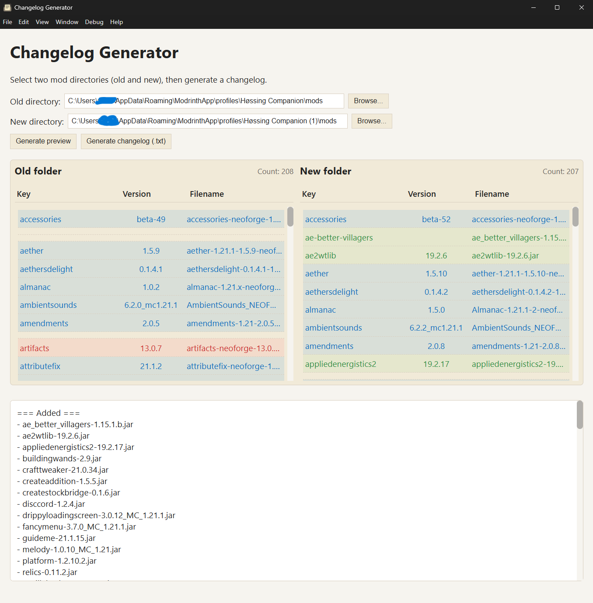
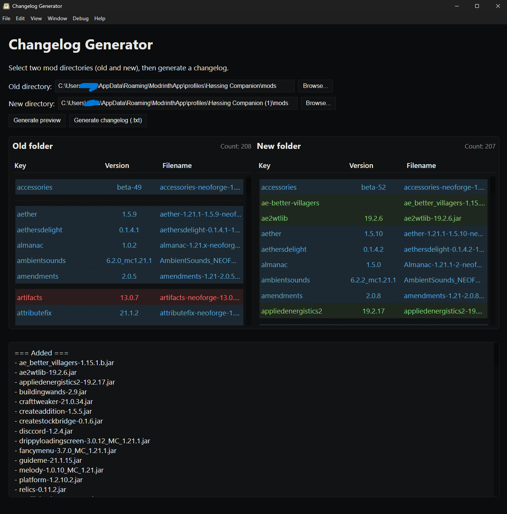

Changelog Generator — User Guide
================================

Screenshots
-----------

What this app does
-------------------
Changelog Generator is a small desktop utility for Windows that compares two folders of Minecraft mod .jar files and produces a human-readable changelog of Added, Updated and Removed mods.

It is designed for end users who want to quickly produce a changelog when updating modpacks or sharing mod lists.

System requirements
-------------------
- Windows 10 or newer
- 64-bit OS recommended
- No network access is required to run the app (all processing is local)

Installation (for non-developers)
--------------------------------
1. Download the .exe for your platform from the project releases.

2. Run the provided executable.

First run / basic usage
-----------------------
1. Open the app — it shows two panels: Old folder (left) and New folder (right).
2. Select the Old folder (the folder containing the previous set of mods) using the Browse button or enter a path.
3. Select the New folder (the updated set of mods).
4. Click "Generate preview" to scan both folders and show a side-by-side preview.
5. Review the results: items will be highlighted as Added, Updated, or Removed.
6. Click "Generate changelog (.txt)" to save a plain-text changelog you can attach to your release or share with others.

Output formats
--------------
- Plain text (.txt) — easy to paste into changelogs and vanilla platforms.

Privacy & safety
----------------
- All processing is done locally on your machine. The app does not phone home or upload your files.
- The app reads filenames to infer mod names and versions. If you want to avoid revealing file names, run it locally and share only the exported changelog.

Troubleshooting
---------------
- Blank window after install: If the UI doesn't load, try running the packaged executable once from the command line to see console errors. Open an issue with the error output if the problem persists.
- Build/extraction errors (Windows): If you run a locally built installer and see extraction errors, re-run the installer as Administrator. (This applies to building installers, not to the installed app.)

Support & feedback
------------------
If you encounter bugs or want to request a feature, open an issue in the project's repository and include:
- The platform and OS version
- A short description of the problem
- Any error messages or screenshots

Legal
-----
- License: MIT

Thank you for using Changelog Generator — we hope it makes releasing modpack updates simpler and clearer.
